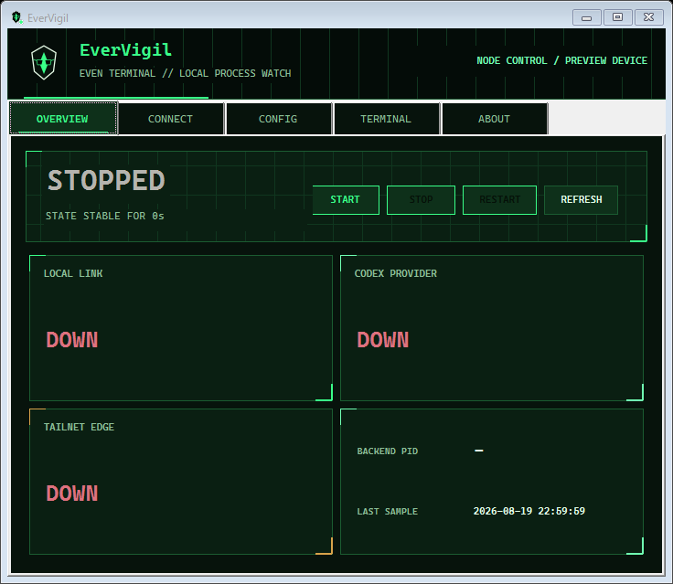
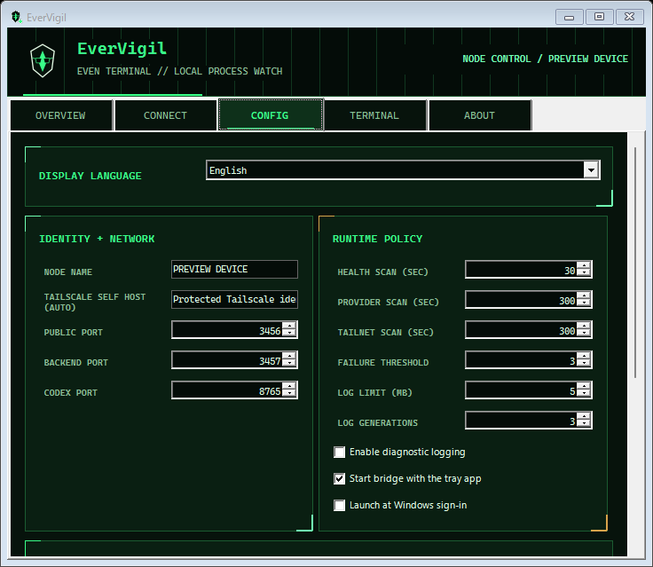
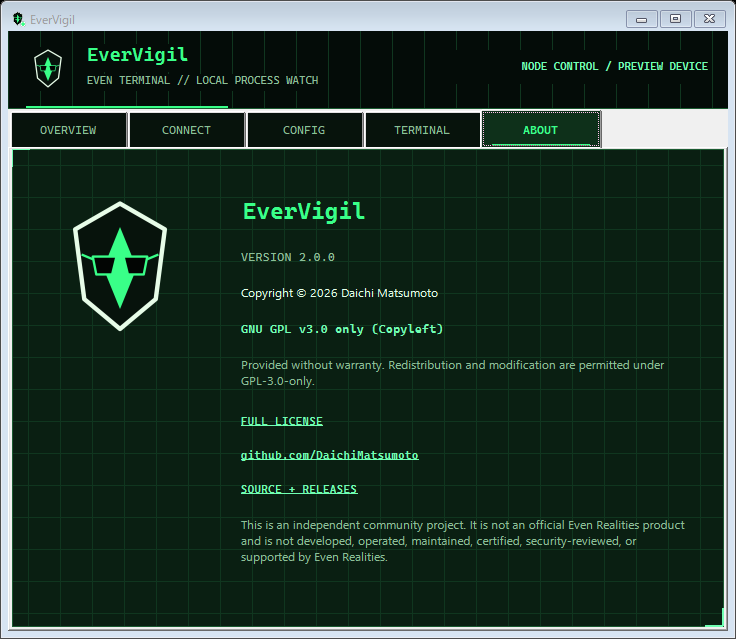
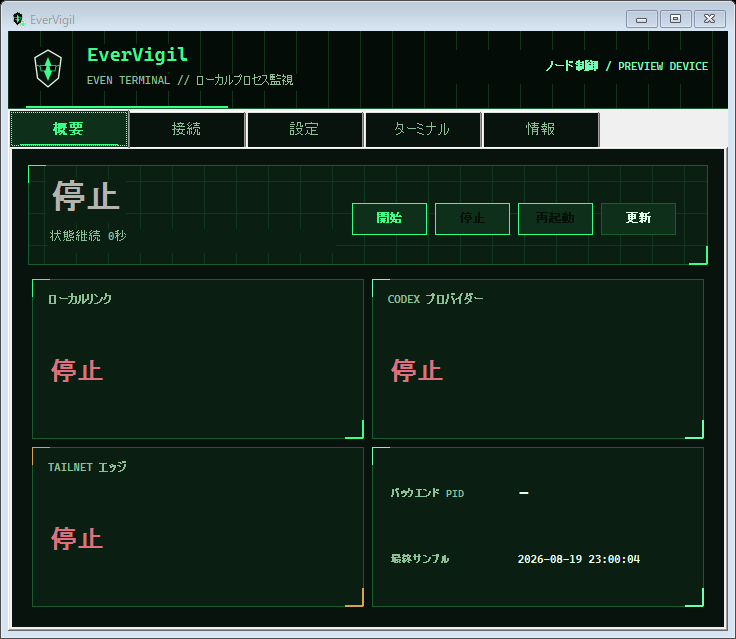
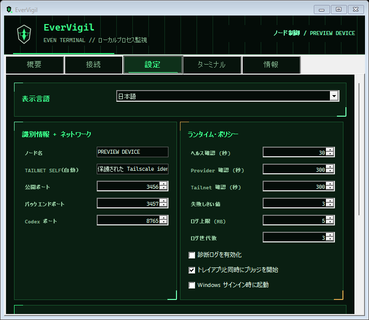
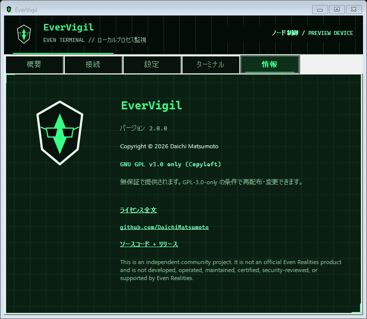

# EverVigil

[English guide](docs/README.en.md) | [日本語ガイド](docs/README.ja.md) | [Technical overview](docs/TECHNICAL_OVERVIEW.en.md) | [技術概要](docs/TECHNICAL_OVERVIEW.ja.md)

This is an independent community project. It is not an official Even Realities product and is not developed, operated, maintained, certified, security-reviewed, or supported by Even Realities.

An independent Windows tray utility that keeps Even Terminal running and available.

EverVigil supervises a separately installed copy of
[`@evenrealities/even-terminal`](https://www.npmjs.com/package/@evenrealities/even-terminal)
and a separately installed Codex CLI. It does not bundle, fork, patch, or
redistribute either product.

## What it does

- Starts Even Terminal and the Codex app-server without opening a console window.
- Supervises child processes and applies bounded restart backoff after failures.
- Starts in the Windows notification area at login when the user enables startup.
- Configures an ownership-checked, Tailnet-only Tailscale Serve route.
- Provides a locally generated QR connection panel with explicit secret reveal.
- Performs health checks and redacts credentials before writing bounded logs.
- Supports transactional install, manual update, rollback, and ownership-safe removal.
- Provides English and Japanese UI.

## Screenshots

The screenshots below are rendered from the application UI with isolated
preview data. They contain no connection URL, QR code, bridge token, account,
or device credential.

### English

| Overview | Configuration | About |
|---|---|---|
|  |  |  |

### 日本語

| 概要 | 設定 | 情報 |
|---|---|---|
|  |  |  |

## Network path

```text
Even client / G2
  -> Tailscale Tailnet
  -> Tailscale Serve :3456
  -> 127.0.0.1:3457 Even Terminal
  -> 127.0.0.1:8765 Codex app-server
```

Tailscale Serve is Tailnet-only. EverVigil does not enable Funnel and does not
publish the service to the public Internet. Access remains subject to the
Tailnet's identity and ACL policy. Serve forwards to the loopback address shown
above, and an owned Windows Firewall rule blocks direct inbound access to the
Even Terminal backend.

The currently tested upstream package, `@evenrealities/even-terminal` 0.8.1,
binds its HTTP listener to `0.0.0.0`. EverVigil does not patch that package, so
a strict loopback-only backend bind is not currently achievable. The Firewall
rule is required mitigation; this upstream limitation remains an explicit
release risk rather than being treated as a completed loopback-bind guarantee.

## Install and update

EverVigil v2.0.0 is the first public release:

1. Download `EverVigil-2.0.0-Setup.exe` from the GitHub Release.
2. Compare the file's SHA-256 with the value published in that Release.
3. Run the installer and review the independent-project notice.

EverVigil has no automatic updater. Community builds are not
Authenticode-signed and may trigger Microsoft Defender SmartScreen. Verify the
SHA-256 before running an installer.

Future releases will use the same manual download and checksum-verification
flow. The separate migration from the legacy v1.2.1 product remains an
authenticated in-place migration. See [Upgrade from the legacy
application](docs/TECHNICAL_OVERVIEW.en.md#9-upgrade-from-even-terminal-supervisor).

## Connection credentials

The connection URL has this form:

```text
http://<Tailscale-hostname>:3456/?token=<bridge-token>&defaultProvider=codex
```

The URL and its QR code are credentials. They are hidden by default, shown only
after an explicit Reveal action, hidden again after approximately 60 seconds
and when the window loses focus, and never sent to an external QR service.
Do not publish them in screenshots, Issues, chats, or logs.

Hiding the display does not expire or rotate the token. Regenerate the bridge
token after suspected disclosure. While the bridge is running, the plaintext
token exists in its process environment; DPAPI protects the stored token at
rest, not the live child process from same-user software or an administrator.

EverVigil does not read, store, or transmit Codex authentication credentials.

## Uninstall

Use Windows Installed Apps or the EverVigil Start menu uninstall shortcut. The
uninstaller stops EverVigil and its owned child processes, removes only owned
Serve, Firewall, startup, shortcut, transaction, and application resources,
and asks whether settings and the encrypted token should be retained.
It does not remove Tailscale, Node.js, Codex, the separately installed Even
Terminal package, or unrelated user data.

## Documentation

- [English user guide](docs/README.en.md)
- [日本語ユーザーガイド](docs/README.ja.md)
- [English technical overview](docs/TECHNICAL_OVERVIEW.en.md)
- [日本語技術概要](docs/TECHNICAL_OVERVIEW.ja.md)
- [English technical reference](docs/REFERENCE.en.md)
- [日本語技術リファレンス](docs/REFERENCE.ja.md)
- [Security details](docs/SECURITY.en.md) / [セキュリティ詳細](docs/SECURITY.ja.md)

## License and artwork

Copyright © 2026 [Daichi Matsumoto](https://github.com/DaichiMatsumoto).
EverVigil source code is licensed under
[GNU General Public License version 3 only](LICENSE) (`GPL-3.0-only`).

The icon is independently generated original artwork made from neutral
geometric shapes. It is not derived from, traced from, or based on Even
Realities artwork. See [NOTICE.md](NOTICE.md) for provenance details.

Repository: <https://github.com/DaichiMatsumoto/evervigil>
